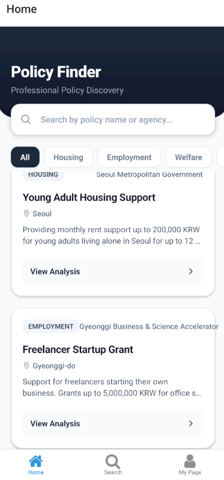
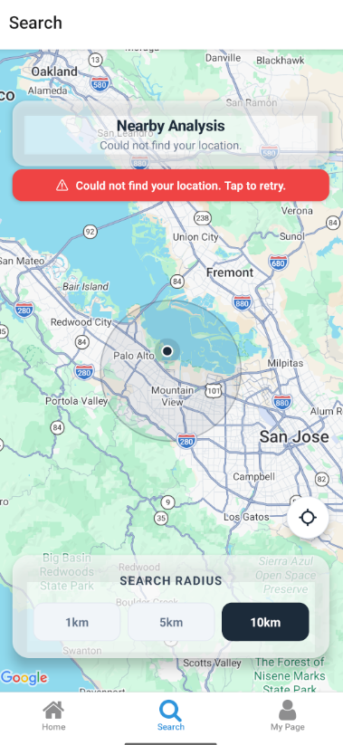
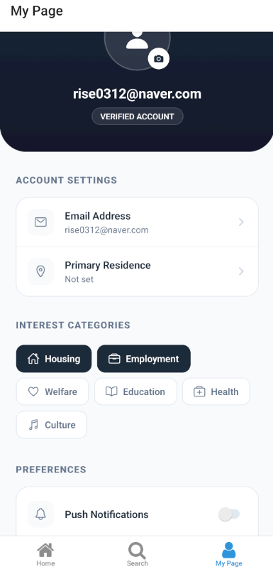

# Policy Finder (Knock Evo)

Policy Finder는 사용자의 거주지 및 관심 분야에 맞는 정부 및 지자체 정책을 쉽고 빠르게 찾을 수 있도록 돕는 React Native 기반의 모바일 애플리케이션입니다.

## 🚀 주요 기능

### 1. 정책 검색 (Home)

사용자의 관심 카테고리별로 정책을 필터링하고 검색할 수 있습니다. 각 정책은 카드 형태로 제공되며, 상세 분석 정보를 확인할 수 있습니다.

- **카테고리 필터:** 주거, 고용, 복지, 교육 등 맞춤형 필터링
- **실시간 검색:** 정책명 또는 제공 기관명으로 검색

### 2. 주변 정책 탐색 (Search)

현재 사용자의 위치를 기반으로 반경 내의 정책 정보를 지도 상에서 시각적으로 확인합니다.

- **반경 설정:** 1km, 5km, 10km 단위로 탐색 범위 조정
- **위치 기반 서비스:** 현재 위치 중심의 정책 분포 확인

### 3. 맞춤 설정 (My Page)

개인별 거주지 설정 및 관심 카테고리를 관리하여 최적화된 정책 정보를 추천받습니다.

- **거주지 설정:** 전국 주요 지역 선택 가능
- **관심 분야 관리:** 관심 있는 정책 분야(주거, 고용 등) 다중 선택

## 📸 주요 화면

|               Home (정책 검색)               |               Search (지도 탐색)               |              My Page (맞춤 설정)               |
| :------------------------------------------: | :--------------------------------------------: | :--------------------------------------------: |
|  |  |  |

## 🛠 Tech Stack

- **Frontend:** React Native (Expo)
- **Backend:** Supabase (Auth, DB)
- **State Management:** React Hooks
- **Animation:** React Native Reanimated
- **Map:** React Native Maps
- **Haptics:** Expo Haptics (진동 피드백)

## 🏗 프로젝트 구조

- `app/(tabs)`: 메인 탭 화면 (Home, Search, My Page)
- `app/(auth)`: 로그인 및 회원가입
- `app/policy`: 정책 상세 페이지
- `lib/supabase`: Supabase 설정 및 API 연동
- `components`: 공통 UI 컴포넌트

- `app/(tabs)`: 메인 탭 화면 (Home, Search, My Page)
- `app/(auth)`: 로그인 및 회원가입
- `app/policy`: 정책 상세 페이지
- `lib/supabase`: Supabase 설정 및 API 연동
- `components`: 공통 UI 컴포넌트
